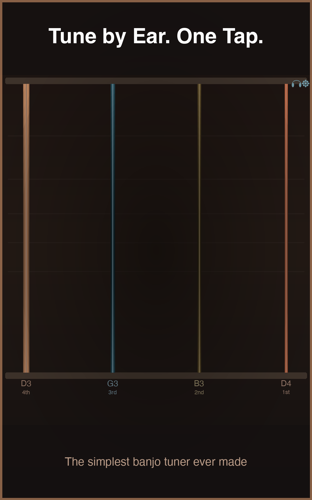
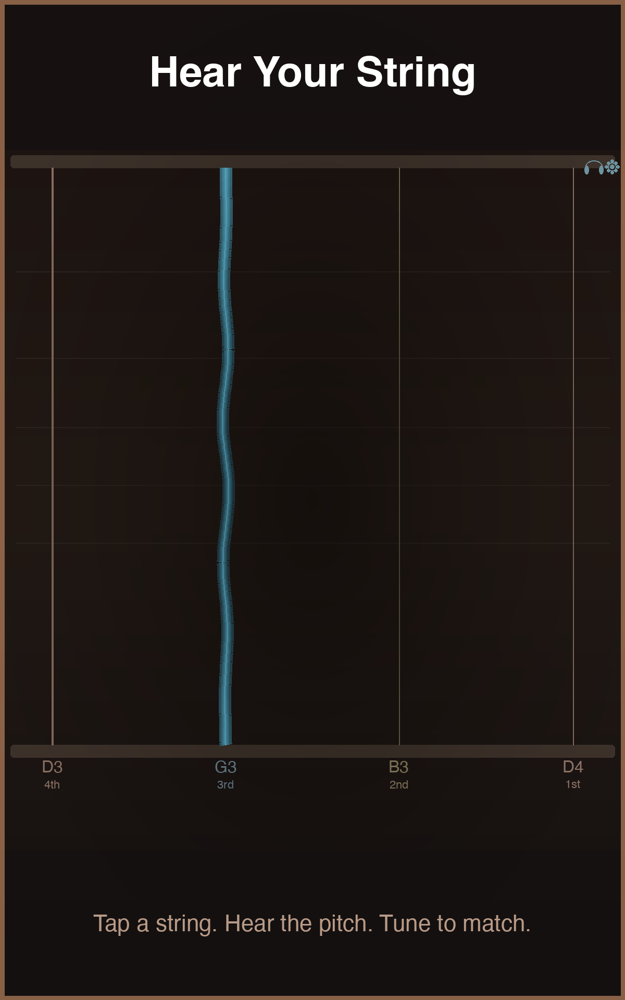
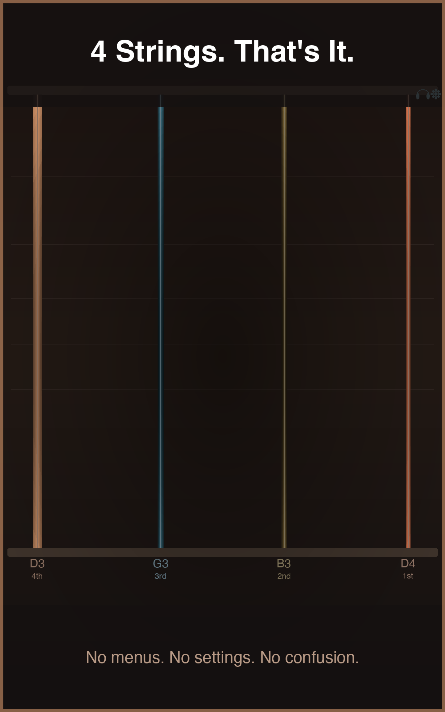
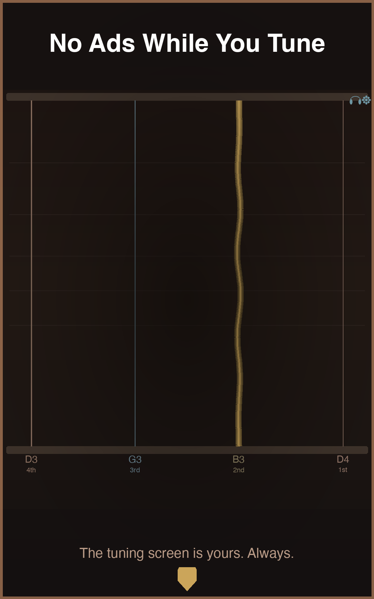

# Android Banjo Tuner [Google Play](https://play.google.com/store/apps/details?id=com.makingiants.android.banjotuner)

Android app to help to tune a 4 string banjo

## Screenshots

  
  
  
  

## License

* [Apache Version 2.0](http://www.apache.org/licenses/LICENSE-2.0.html)

## Contributing

Please fork this repository and contribute back using pull requests.

Any contributions, large or small, major features, bug fixes, additional
language translations, unit/integration tests are welcomed and appreciated
but will be thoroughly reviewed and discussed.

## About

+ Daniel Gomez
+ here.makin.giants@gmail.com
